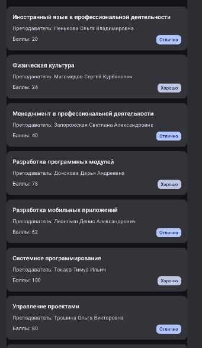
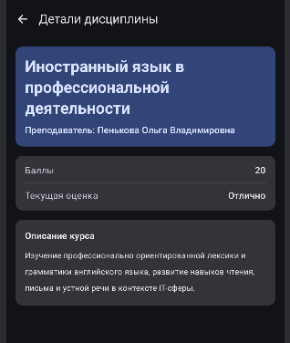
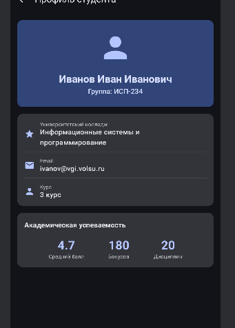
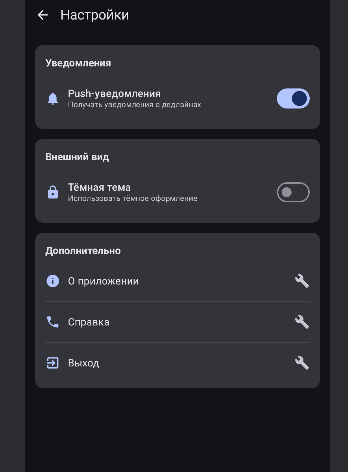

# Студенческий планер

## Описание
Приложение «Студенческий планер» разработано для удобного просмотра учебных дисциплин, информации о преподавателях, текущих оценках и описаниях курсов. Реализованы экраны главного меню, деталей дисциплины, профиля студента и настроек с использованием современных подходов навигации в Jetpack Compose.

## Реализованные экраны
- **Главная (`Home`)** — список всех дисциплин в виде карточек
- **Детали дисциплины (`Details`)** — подробная информация о выбранной дисциплине (название, преподаватель, баллы, оценка, описание)
- **Профиль (`Profile`)** — информация о студенте: ФИО, группа, специальность, email, статистика успеваемости
- **Настройки (`Settings`)** — управление уведомлениями, темой оформления и дополнительными функциями
- **Расписание (`Schedule`)** — недельное расписание занятий с возможностью перехода к деталям дисциплины

## Используемые технологии
- **Язык программирования**: Kotlin
- **UI-фреймворк**: Jetpack Compose
- **Навигация**: Navigation Compose (`androidx.navigation:navigation-compose:2.7.6`)
- **Архитектура**: MVVM-подобный подход с разделением UI и данных, использование `sealed class` для маршрутов

## Скриншоты
- Главный экран: 
- Экран деталей: 
- Профиль: 
- Настройки: 

---

## Ответы на контрольные вопросы

### 1. Что такое NavController и для чего он используется?
**NavController** — это центральный компонент Navigation Compose, который управляет переходами между экранами, обрабатывает нажатия кнопки «Назад» и хранит историю посещённых экранов (Back Stack).  
Создание через **`rememberNavController()`** гарантирует, что контроллер будет сохранён при рекомпозиции UI и не будет пересоздаваться, что предотвращает сброс состояния навигации.

### 2. Как передать параметр в маршрут навигации?
Процесс:
1. В маршруте указывается placeholder: `"details/{subjectId}"`
2. При переходе подставляется значение: `navController.navigate("details/123")`
3. В `composable` извлекается аргумент: `backStackEntry.arguments?.getString("subjectId")`

**Обязательные параметры** требуют значения при переходе. **Опциональные** (через `navArgument` с `defaultValue`) могут быть пропущены.

### 3. Зачем использовать sealed class для маршрутов?
**Преимущества**:
- Компилятор знает все возможные маршруты → меньше ошибок опечаток
- Поддержка рефакторинга: изменение имени маршрута автоматически обновится во всём коде
- Централизованное хранение всех путей

**Пример ошибки без sealed class**:  
`navController.navigate("detalis/1")` — опечатка в слове `"details"` не вызовет ошибку компиляции, но сломает навигацию.

### 4. Что такое Back Stack и как им управлять?
**Back Stack** — стек экранов, по которым перемещался пользователь (LIFO: последний зашёл — первый вышел).
### 5. Как работает startDestination в NavHost?
- **`startDestination`** определяет маршрут, который отображается при первом запуске приложения. В нашем случае — `"home"`.
- Изменить его **динамически нельзя** напрямую, но можно условно выбрать начальный экран до создания `NavHost` (например, проверить авторизацию и показать `Login` вместо `Home`).

### 6. Что произойдёт, если навигировать на несуществующий маршрут?
- **NavController** выбросит исключение `IllegalArgumentException`: *"Navigation destination [...] is not a direct child of this NavGraph"*.
- **Обработка**: всегда используйте `sealed class` или константы для маршрутов, чтобы избежать опечаток. Также можно обернуть `navigate()` в `try-catch` для критических случаев.

### 7. Зачем нужен параметр launchSingleTop?
Параметр **`launchSingleTop = true`** предотвращает создание нескольких копий одного и того же экрана в стеке.  
**Пример проблемы без него**:  
Пользователь быстро нажимает на одну и ту же дисциплину 3 раза → создаются 3 одинаковых экрана `Details`. При нажатии «Назад» придётся выходить 3 раза.  
**Влияние на Back Stack**: если экран уже находится **на вершине** стека, новый не создаётся — стек остаётся неизменным.